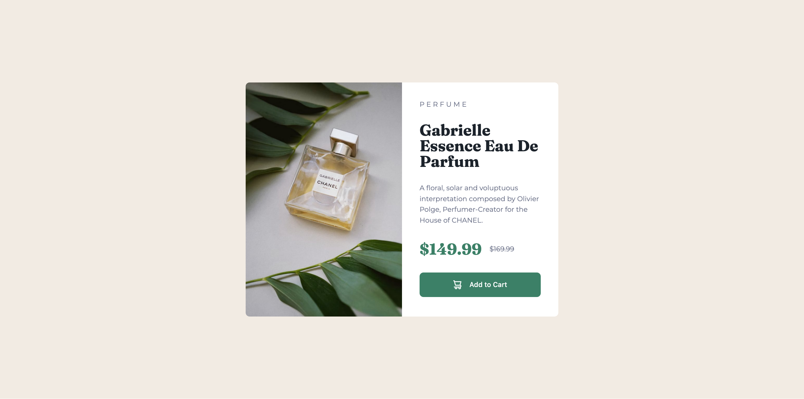

# Frontend Mentor - Product preview card component solution

This is a solution to the [Product preview card component challenge on Frontend Mentor](https://www.frontendmentor.io/challenges/product-preview-card-component-GO7UmttRfa). Frontend Mentor challenges help you improve your coding skills by building realistic projects. 

## Table of contents

- [Overview](#overview)
  - [The challenge](#the-challenge)
  - [Screenshot](#screenshot)
  - [Links](#links)
- [My process](#my-process)
  - [Built with](#built-with)
  - [What I learned](#what-i-learned)
  - [Continued development](#continued-development)
  - [Useful resources](#useful-resources)

**Note: Delete this note and update the table of contents based on what sections you keep.**

## Overview

### The challenge

Users should be able to:

- View the optimal layout depending on their device's screen size
- See hover and focus states for interactive elements

### Screenshot



### Links

- Solution URL: [https://github.com/dpencsi/frontendmentor-product-preview-card-component](https://github.com/dpencsi/frontendmentor-product-preview-card-component)
- Live Site URL: [https://dpencsi.github.io/frontendmentor-product-preview-card-component/](https://dpencsi.github.io/frontendmentor-product-preview-card-component/)

## My process

### Built with

- Semantic HTML5 markup
- CSS custom properties
- Flexbox
- CSS Grid
- Mobile-first workflow

### What I learned

Well I think the `picture` tag when you have to use different pictures or in this case cropped images using the `source` tag inside the `picture` tag. With the `source` tag you can commend the browser which image you would like to load in what condition like in a breakpoint like with media query inside the `source` tag as an attribute `media="(min-width: 37.5rem)`

```html
<!-- Item Picture -->
      <picture class="item-image">
        <source srcset="./images/image-product-desktop.jpg" media="(min-width: 37.5rem)">
        
      </picture>
```

### Continued development

I still need to practice and used to about sizes form `px` to `rem` or `em`.

### Useful resources

- [PX to REM converter](https://nekocalc.com/px-to-rem-converter) - This helped me convert the sizes from one measure to another one.
- [Web Dev - Responsive Design](https://web.dev/learn/design/welcome) - This is a nice learning platform where you can learn about responsive design.